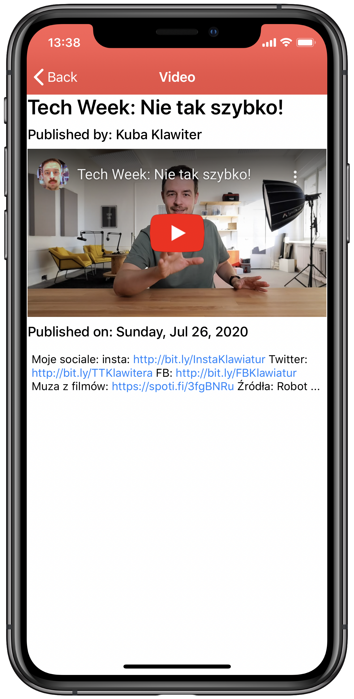

# YouTube Browser
iOS YouTube browser

Application created for improving Swift skills purposes.
To use it you should enter your YouTube Api Key in Constants.swift file after you clone the repository.

## Feature
App is designed to be simple Youtube Browser. User can find any public video, watch them and see the details.

## Screenshots

